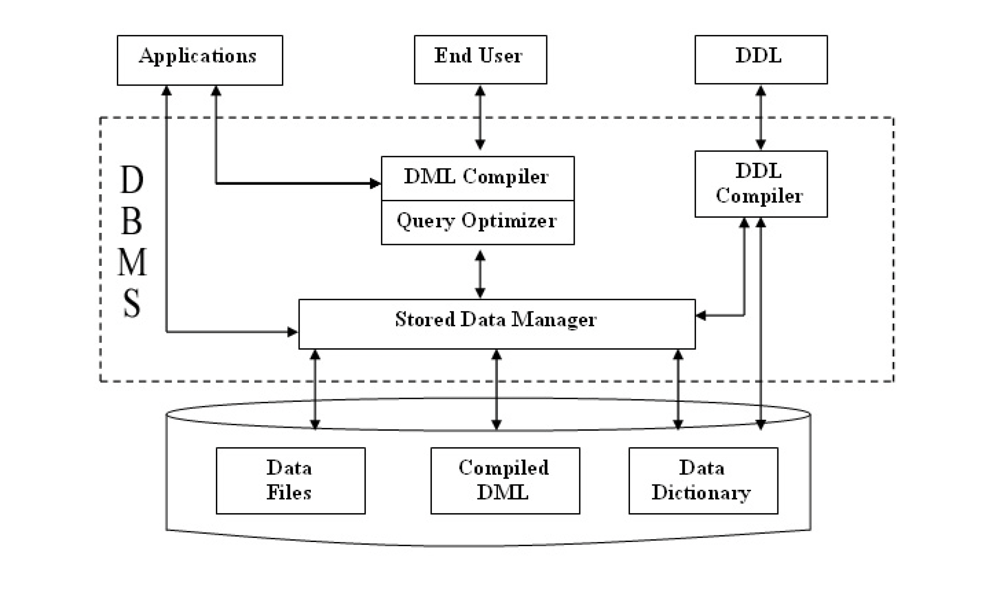
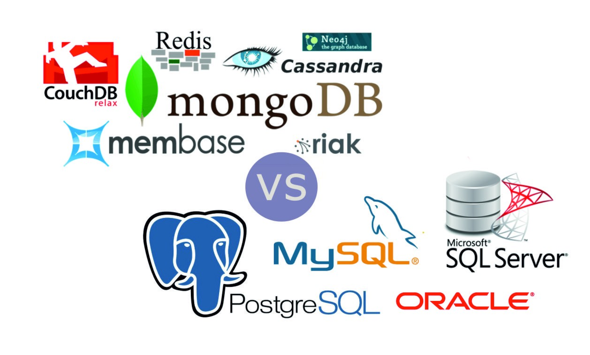

# Introducción

## Conceptos Generales

### ¿Qué es una base de datos?

En computación, una base de datos es un conjunto de archivos dedicados a guardar información relacionada entre sí, con referencia entre ellos de manera que se complementen y con la posibilidad de relacionarlos en base a diferentes criterios.

- **Dato**: es un conjunto de caracteres con algún significado, pueden ser numéricos, alfabéticos, o alfanuméricos. Es la unidad mínima de información.
- **Información**: es un conjunto ordenado de datos los cuales son manejados según la necesidad. Para que un conjunto de datos pueda ser procesado eficientemente y pueda dar lugar a información, primero se debe guardar lógicamente en archivos.

### La información debe ser...

- **Accesible**: es la facilidad y rapidez para poder acceder a ella.
- **Clara**: debe ser integra y fácil de entender.
- **Precisa**: lo más exacta posible.
- **Propia**: debe haber la mayor similitud entre el resultado creado y lo que el usuario pide.
- **Oportuna**: el proceso de entrada-procesamiento-entrega al usuario debe ser en el menor tiempo posible.
- **Flexible**: la información se puede adaptar a la toma de decisiones que mejor convenga.
- **Verificable**: la información debe ser totalmente fiable para que se pueda verificar en el momento deseado.
- **Imparcial**: la información debe poder modificarse tanto por el administrador, como por el usuario dueño de la base.
- **Cuantificable**: la información puede ser el resultado de cualquier dato procesado.

## Gestores de base de datos

Un **Sistema Gestor de Base de Datos (SGBD) o DataBase Managenent System (DBMS)**, es un sistema compuesto por múltiples programas informáticos que en su conjunto permiten la creación, gestión y administración de bases de datos. En base a su paradigma de diseño, estos sistemas generan las estructuras necesarias para el almacenamiento y búsqueda de información del modo más eficiente posible.

    

Lenguaje de definición de datos (DDL: Data Definition Language). Las sentencias DDL se utilizan para crear y modificar la estructura de las tablas así como otros objetos de la base de datos.

- **CREATE**: para crear objetos en la base de datos.
- **ALTER**: modifica la estructura de la base de datos.
- **DROP**: borra objetos de la base de datos.
- **TRUNCATE**: elimina todos los registros de la tabla, incluyendo todos los espacios asignados
  a los registros.

Lenguaje de manipulación de datos (DML: Data Manipulation Languange). Las sentencias DML son utilizadas para gestionar datos dentro de los schemas. Algunos ejemplos:

- **SELECT**: para obtener datos de una base de datos.
- **INSERT**: para insertar datos a una tabla.
- **UPDATE**: para modificar datos existentes dentro de una tabla.
- **DELETE**: elimina todos los registros de la tabla; no borra los espacios asignados a los
  registros.

## Estado actual y principales desafíos

En los años 90 y principios del 2000, las bases de datos relacionales fueron evolucionando junto con Internet y los movimientos de código abierto, adicionalmente las compañías de Hardware eran capaces de proporcionar mejores componentes de procesamiento y almacenamiento cada vez a menor costo.

Post auge de las punto com, las redes sociales y la conectividad movil comenzaron a marcar pauta a finales de los 2000, pues el mundo estaba generando datos de manera impensada y descontrolada. Con la necesidad imperiosa de poder capturar, almacenar, procesar y analizar los grandes volúmenes de datos, los cientificos de la computación (al igual que los años 60 y 70), empezaron a crear nuevas formas de administrar los datos.

> Para obtener información a partir de los datos, no es necesario a priori conocer su estructura.

> La vigencia de los datos es tan efímera, que aunque los almacenemos en alguna parte, seguramente será muy difícil tener el tiempo o la oportunidad de analizarlos en el futuro.

## Tendencias

- **Computación en la nube**. Externalización del Hardware, ahora se paga por uso (procesamiento). La escalabilidad es dínamica, sube o baja en función de la dinámica de uso.
- **Memoria y más memoria**. Base de datos en memoria, son la solución para resolver problemas de alta disponibilidad y analítica avanzada.
- **El mejor Mix**. Base de datos relacionales conviviendo con bases de datos no relacionales. Obteniendo lo mejor ambos mundos.
- **Big Data**. Primeros casos de uso en el mundo utilizando por fin esta tecnología.
- **Descentralización de los datos**. ¿Es posible vivir en un mundo en que los datos sean de todos? Blockchain al parecer es la respuesta.

## Principales actores

    

