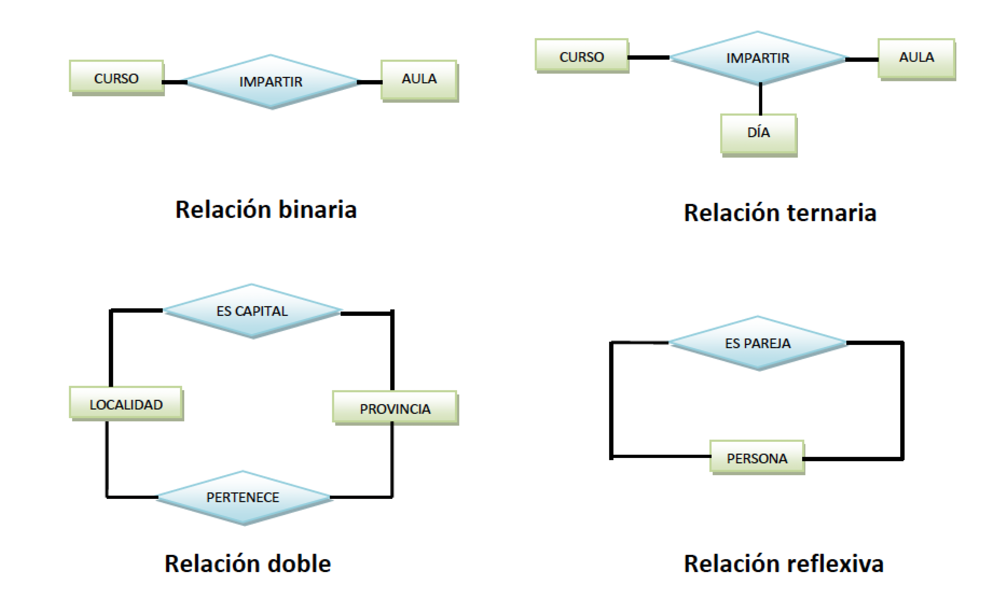
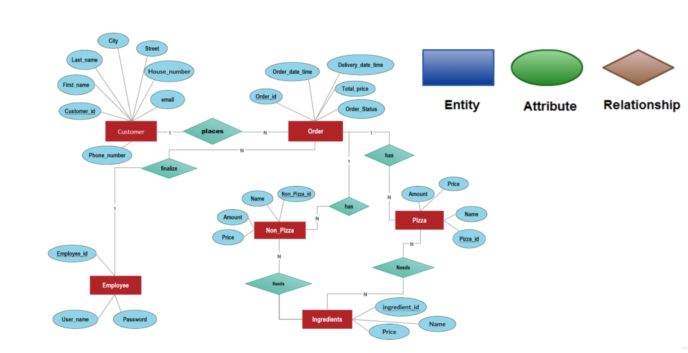
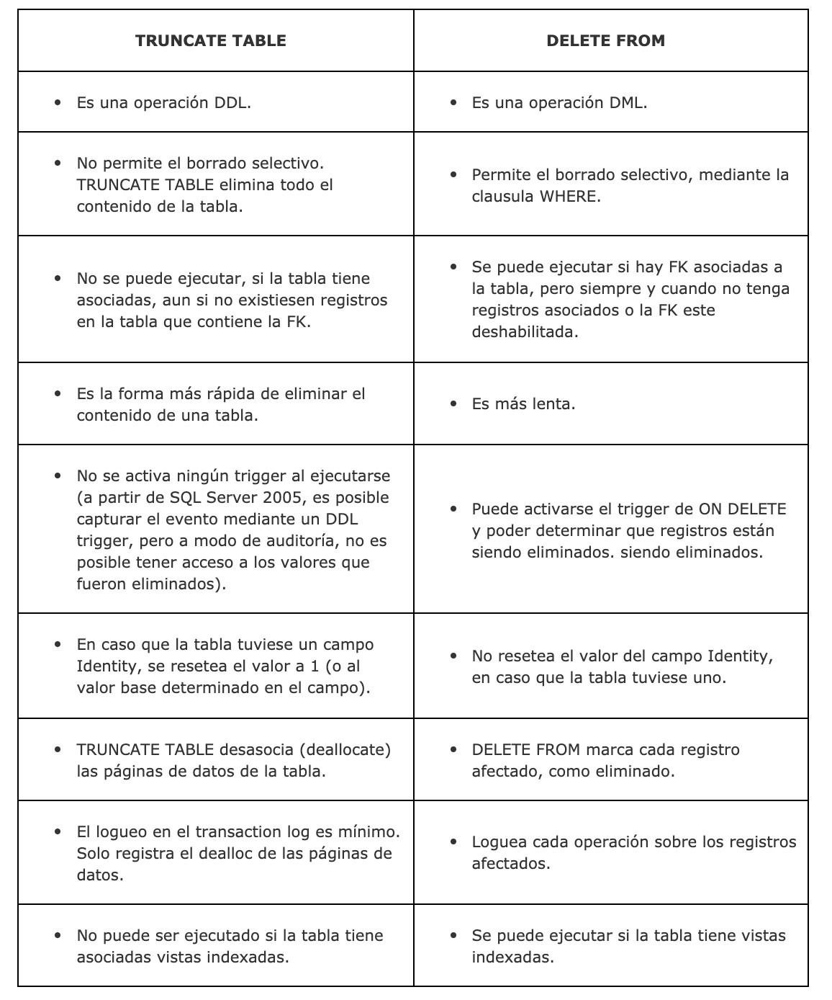

# 💾 Base de datos relacionales 💾

Las bases de datos relacionales se basan en el modelamiento de un fenómeno real bajo una estructura pre definida que permita saber lo que ahí ocurre.

## Introducción

### ¿ Por qué existen?

Existen porque representan fielmente la abstracción humana en términos de cómo procesamos la información en nuestro cerebro. Conectamos ideas, pensamientos y objetos, y las almacenamos en nuestra memoria con cierta estructura. Todo lo que sabemos o conocemos lo interconectamos para tomar alguna acción o decisión.

### Componentes de abstracción

- **Entidad**: persona, lugar, objeto o evento de interés acerca del cual se recogen o procesan datos. Esta se representa por medio de un rectángulo, mismo que contiene dentro el nombre de la entidad.
- **Atributo**: es una característica de una entidad o de una relación en función de lo que nos interesa en nuestra aplicación. Su representación gráfica es una elipse.
- **Relación**: Describe la interacción entre dos o más entidades.

<p align="center">
    
</p>

Una **Tabla** es un conjunto de datos dispuesto en una estructura de filas y columnas. En una tabla las filas se denominan registros y las columnas campos; la primera fila contiene los nombres de campo. Cada campo contiene determinado tipo de datos y tiene una longitud expresada en el número de caracteres máximo del campo. Para crear una tabla es necesario definir su estructura:

- El nombre de la tabla.
- Los tipos de dato de cada campo.
- Las propiedades o características de cada campo.
- El campo clave.

<p align="center">
    
</p>

## Principales vendors

<p align="center">
    
</p>

## Conceptos básicos

### Tipos de datos

- [PostgreSQL](https://www.postgresql.org/docs/9.5/datatype.html)
- [SQL Server](https://docs.microsoft.com/en-us/sql/t-sql/data-types/data-types-transact-sql?view=sql-server-ver15)

### Creación de objetos

#### Roles de usuarios

Los permisos de acceso en PostgreSQL se administran definiendo roles. Dentro de este concepto se incluyen tanto los usuarios como los grupos. La diferencia principal entre ambos es que, mientras el rol de tipo usuario se usa para acceder y trabajar con la base de datos, los grupos agregan a usuarios y definen permisos sobre esquemas y objetos de la estructura.

```sql
-- Ejemplo rol master con privilegios de super usuario.
CREATE ROLE master WITH
LOGIN
SUPERUSER
INHERIT
CREATEDB
CREATEROLE
REPLICATION
PASSWORD 'master.PASS'
VALID UNTIL '2022-01-01';
```

#### Base de datos

```sql
-- Base de datos por defecto.
CREATE DATABASE sales;

-- Crea una base de datos llamada "sales" cuyo owner es el usuario "salesapp" en el espacio de tablas "salesspace".
CREATE TABLESPACE salesspace LOCATION '/data/dbs';
CREATE DATABASE sales OWNER master TABLESPACE salesspace;
```

#### Esquemas

```sql
CREATE SCHEMA IF NOT EXISTS app AUTHORIZATION master;
```

#### Tablas

```sql
-- Creación de una tabla.
CREATE TABLE app.sales (
    InvoiceItemNumber VARCHAR(256),
    SaleDate DATE,
    StoreNumber INT,
    StoreName VARCHAR(256),
    Address VARCHAR(256),
    City VARCHAR(256),
    ZipCode VARCHAR(32),
    StoreLocation VARCHAR(256),
    CountyNumber INT,
    County VARCHAR(256),
    Category INT,
    CategoryName VARCHAR(256),
    VendorNumber INT,
    VendorName VARCHAR(256),
    ItemNumber INT,
    ItemDescription VARCHAR(256),
    Pack INT,
    BottleVolume MONEY,
    StateBottleCost MONEY,
    StateBottleRetail MONEY,
    BottlesSold INT,
    SaleDollars MONEY,
    VolumeSoldLiters FLOAT,
    VolumeSoldGallons FLOAT
);
```

#### Carga de datos

```sql
-- https://www.kaggle.com/residentmario/iowa-liquor-sales/version/2
COPY app.sales(
	InvoiceItemNumber,
    SaleDate,
    StoreNumber,
    StoreName,
    Address,
    City,
    ZipCode,
    StoreLocation,
    CountyNumber,
    County,
    Category,
    CategoryName,
    VendorNumber,
    VendorName,
    ItemNumber,
    ItemDescription,
    Pack,
    BottleVolume,
    StateBottleCost,
    StateBottleRetail,
    BottlesSold,
    SaleDollars,
    VolumeSoldLiters,
    VolumeSoldGallons
)
FROM '/files/sales.csv'
DELIMITER ','
CSV HEADER;
```

### Consultas

#### Selección de datos

```sql
-- Seleccionar todos los registros de una tabla.
SELECT * FROM app.sales;

-- Seleccionar algunos campos solamente.
SELECT
    InvoiceItemNumber,
    SaleDate,
    StoreNumber,
    StoreName,
    Address
FROM app.sales;

-- Limitar el número de registros a retornar a 100 solamente.
SELECT
    InvoiceItemNumber,
    SaleDate,
    StoreNumber,
    StoreName,
    Address
FROM app.sales
LIMIT 100;

-- Selección con condiciones.
-- Ej. Las ventas mayores a 100 dólares realizadas en la ciudad de WATERLOO y SHELDON ordenados descendentemente por fecha.
SELECT *
FROM app.sales
WHERE SaleDollars > 100
AND City IN ('WATERLOO', 'SHELDON')
ORDER BY SaleDate DESC;
```

#### Actualización de datos

```sql
-- Actualización bajo condiciones.
UPDATE app.sales SET
    SaleDate = '2020-01-01'
WHERE SaleDate IS NULL;
```

#### Eliminación de datos

<p align="center">
    
</p>

```sql
-- Elimina todos los registros de la tabla. Log mínimo de transacción.
TRUNCATE TABLE app.sales;

-- Elimina ciertos registros en base a algunas condiciones entregadas
-- El Log dependerá de la envergadura de la transacción.
DELETE FROM app.sales
WHERE SaleDollars < 100;
```

## Conceptos avanzados

#### Índices

Existen varios tipos de índices: B-tree, Hash, GiST o GIN. Cada tipo de índice utiliza un algoritmo diferente que se adapta mejor a diferentes tipos de consultas. De forma predeterminada, el comando CREATE INDEX crea índices de B-tree (Árbol B), que se ajustan a las situaciones más comunes. Comentar también que al definir una Clave Primaria (PRIMARY KEY) sobre el campo de una tabla, este en sí se constituye como un índice, generando una restricción que impide que este campo se repita (UNIQUE) y que contenga valores nulos (NOT NULL).

```sql
-- Indice para búsquedas sobre fecha.
CREATE INDEX idx_sales_sales_date
ON app.sales(SaleDate);

-- Indice para búsquedas sobre ciudad.
CREATE INDEX idx_sales_sales_city
ON app.sales(City);
```

#### Particiones

Para cuando existen tabla muy grandes. (1TB hacia arriba), los índices comienzan a perder poder debido a la volumentría. Para ello existen las particiones de tabla, que segmentan y distribuye en tablas de partición los datos. Esto permite que las consultas puedan ser resueltas de mejor forma. (Ver sección códigos).

```sql
-- Ver la distinución de los registros por partición
SELECT
	tableoid::regclass
	,count(*)
FROM app.sales_sample_range
GROUP BY tableoid::regclass
```

#### Procedimientos almacenados

Permiten automatizar operaciones recurrentes en un contexto de datos. Generalmente operaciones CRUD, transacciones y cálculos batch (Ver sección de códigos).
