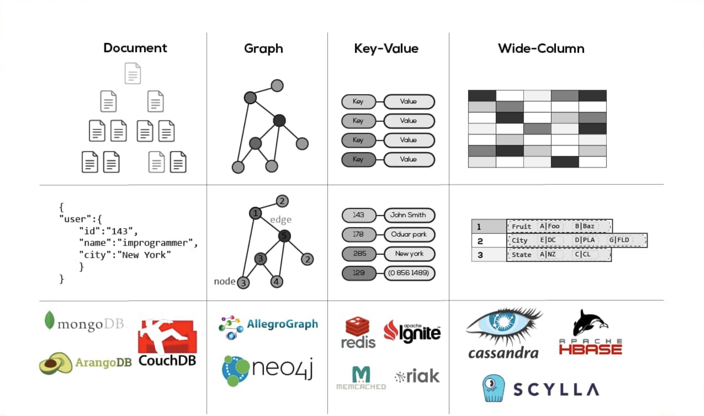
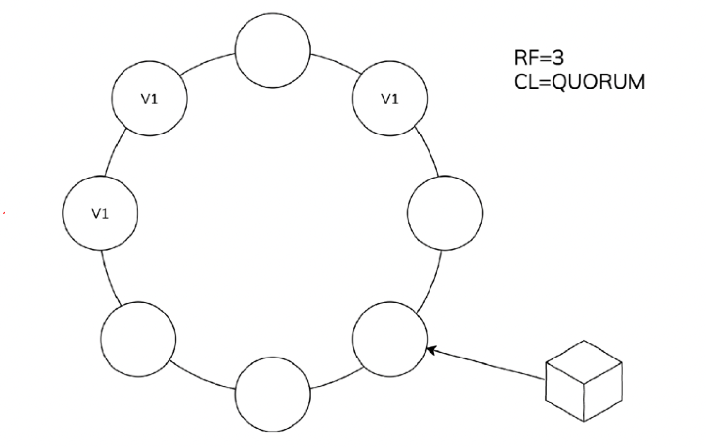
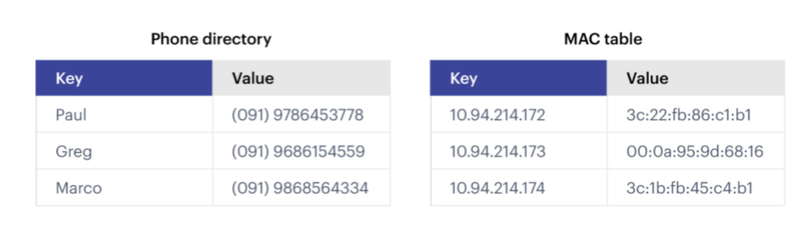

<!-- rmarkdown v1 -->

# 💾 Base de datos no relacionales 💾

# ¿Por qué existen?

Una base de datos no relacional (o NoSQL), se refiere a una gran variedad de tecnologías de bases de datos que se han desarrollado en respuesta a las necesidades de desarrollo de las aplicaciones modernas:

- Los desarrolladores trabajan con aplicaciones que generan enormes volúmenes de datos nuevos y en constante evolución (estructurados, semiestructurados, no estructurados y polimórficos).

- Aquellos ciclos de desarrollo en cascada que duraban entre 12 y 18 meses hace tiempo que pasaron a la historia. Ahora se trabaja en equipos pequeños, que realizan sprints de desarrollo ágiles con iteraciones rápidas, y que generan código cada semana o cada quince días, algunos incluso varias veces al día.

- Las aplicaciones que antes servían a un conjunto finito de usuarios ahora se proporcionan como servicios, que no solo deben funcionar sin interrupción, sino que además tienen que ser accesibles desde muchos dispositivos distintos y deben poder escalarse a millones de usuarios de todo el mundo.

- Las organizaciones ahora están recurriendo a arquitecturas de escalamiento horizontal que utilizan tecnologías de software abierto, servidores básicos y computación en la nube en lugar de grandes servidores monolíticos e infraestructura de almacenamiento.

Las bases de datos relacionales no se diseñaron para poder hacer frente a la escalabilidad y agilidad que necesitan las aplicaciones modernas, ni para beneficiarse de los sistemas de almacenamiento básicos y de la potencia de proceso que existen hoy en día.

# Tipos de abstracción

Tipos de bases de datos no relacionales

- **Bases de datos documentales:** en estas bases de datos se empareja cada clave con una estructura de datos compleja que se denomina 'documento'. Los documentos pueden contener muchos pares de clave-valor distintos, o pares de clave-matriz, o incluso documentos anidados.

- **Almacenes de grafos**: se utilizan para almacenar información sobre redes de datos, como las conexiones sociales. Ejemplos de almacenes de grafos son Neo4J y Giraph.

- **Almacenes de clave-valor**: son las bases de datos NoSQL más simples. Cada elemento de la base de datos se almacena como un nombre de atributo (o _clave_), junto con su valor. Ejemplos de almacenes de clave-valor son Riak y Berkeley DB. En algunos almacenes de clave-valor, como Redis, cada valor puede tener un tipo, como «entero», lo que le añade funcionalidad.

- **Bases de datos orientadas a columnas**: estas bases de datos, como Cassandra o HBase, permiten realizar consultas en grandes conjuntos de datos y almacenan los datos en columnas, en lugar de filas.

# Principales vendors

Según la estrategia de almacenamientos y estilo de abstracción, se pueden encontrar las siguientes alternativas.

<p align="center">
    
</p>

# BBDD documental: Mongo DB

MongoDB es una base de datos de código abierto que admite un modelo de datos orientado a documentos para su funcionamiento. Fue diseñado por Dwight Merriman y Eliot Horowitz cuando enfrentaban problemas de desarrollo y escalabilidad con los enfoques tradicionales de bases de datos relacionales mientras construían aplicaciones web para una empresa de publicidad en Internet llamada doble clic, que ahora es propiedad de Google Inc.

En lugar de usar tablas y filas, como ocurre en las bases de datos relacionales, MongoDB se construye sobre la arquitectura de colecciones y documentos. Estos documentos se componen de conjuntos de pares de valores clave y sirven como la unidad b asica de datos en MongoDB. Por otro lado, la colección contiene conjuntos de documentos y funciones como equivalentes de tablas de bases de datos relacionales.

## Conceptos base documental

MongoDB es una base de datos documental, el elemento esencial es el documento que normalmente se los agrupa en colecciones de documentos similares. Una base de datos en MongoDB es un conjunto de colecciones.

<p align="center">
    
</p>

## Operaciones CRUD

### Creación y eliminar una base de datos

Una base de datos se crea automáticamente cuando se genera algún documento dentro de ella. Previamente debemos indicar sobre qué base de datos trabajar.

```mongo
use cryptos;
```

### Insersión de datos

Creación de documentos y carga en una colección.

```js
// Creando documento.
var pulpFiction = {
  title: "Pulp Fiction",
  director: "Quentin Tarantino",
  year: 1994,
  rating: 9.2,
};

// Creando base de datos movies.
use movies;

// Insertando a la colleccion catalog.
db.catalog.insert(pulpFiction);

// Verificando insersión
db.catalog.find();
```

Carga masiva de archivo json

```shell
mongoimport --jsonArray --db cryptos --collection binanceSymbols --drop --file files/binance.json
```

Carga masiva de archivo csv

```shell
mongoimport -d store -c sales --type csv --file files/sales_sample.csv --headerline
```

**Nota**: los datos a utilizar son obtenidos de esta API: ()[https://www.binance.com/exchange-api/v2/public/asset-service/product/get-products]

### Actualización de datos

Agregar un valor a un atributo en base a un filtro.

```js
db.catalog.update(
  { title: "Pulp Fiction" },
  { $push: { actors: { $each: ["Bruce Willis"] } } }
);
```

### Búsqueda con filtros

```js
db.binanceSymbols.find({ s: "GALAUSDT" });
```

El siguiente ejemplo recupera todos los documentos de la colección donde el symbol sea igual a "BTC/BSUD" o "ETHBUSD":

```js
db.binanceSymbols.find({ s: { $in: ["BTC/BSUD", "ETHBUSD"] } });
```

El siguiente ejemplo recupera todos los documentos de la colección donde el precio de cierre sea menor 100:

```js
db.binanceSymbols.find({ c: { $lt: "100" } });
```

### Ejecución de scripts.

```bash
mongo < files/helloWorld.js

# Ejecutar script en una base de datos específica.
mongo movies < files/insertToCollection.js
```

## BBDD columnares: Apache Cassandra.

Cassandra es un sistema de código abierto distribuido de gestión de base de datos diseñaado para manejar grandes cantidades de datos a través de muchos servidores de conveniencia, proporcionando alta disponibilidad sin ningún punto unico de fallo.

El modelo de datos de Cassandra consiste en particionar las filas, que son reorganizadas en tablas. Las claves primarias de cada tabla tiene un primer componente que es la clave de partición. Dentro de una partición, las filas son agrupadas por las columnas restantes de la clave. Las demás columnas pueden ser indexadas por separado de la clave primaria.

Algunas de las ventajas son:

- Alta disponibilidad, lo que es muy interesante para el sistema en los que una caída sea crucial.
- Tolerancia a particiones y escalado.
- Cantidad de recursos que se tienen disponibles.

Algunas de sus desventajas:

- La conexión de nuevos nodos no es tarea fácil, ya que el mismo se tiene que poner de acuerdo con el resto, y esto conlleva un tiempo.

Debemos saber qué queries se van a ejecutar previamente, ya que al hacer SELECT sufre un poco debido a la manera en la que almacena los datos.

Algunos conceptos:

- Factor de replicación (RF, réplica factor): Cuántos nodos deben contener los datos para este Key Space.
- Nivel de consistencia (CL, Consistency Level): Cuántos nodos deben responder el nodo coordinador para que la solicitud sea exitosa

<p align="center">
    
</p>

## Keyspaces

Los keyspaces son espacios donde se almacenan las tablas (simil a una base de datos relacional) y estas se crean de la siguiente manera. La sentencia DESCRBIBE KEYMAPS muestra los keymaps disponibles. Para acceder a un Keymap, se utiliza el comando USE <nombre keymap>.

```sql
cqlsh> CREATE KEYSPACE movies WITH replication = {'class': 'SimpleStrategy', 'replication_factor': '1'} AND durable_writes = 'true';

-- Verificando la creación del KEYSPACE.
cqlsh> DESCRIBE KEYSPACES;
```

Para insertar registros se utiliza la sentencia INSERT al igual que SQL. Lo importante es saber que para poder hacer consultas y filtros sobre las tablas en Cassandra se requiere previamente indexarlas, pues es la única forma que el motor es capaz buscar los datos y garantizar tiempos de respuesta e integridad de los mismos.

```sql
-- Usando el KEYSPACE movies.
cqlsh> USE movies;

-- Creando tabla catalog ordenada por nombre.
cqlsh:movies> CREATE TABLE catalog_by_name (id int PRIMARY KEY , name text, director text, year int, rating float, actors list<text>);

-- Verificando la creación de la tabla.
cqlsh:movies> DESCRIBE TABLES ;

-- Insertando algunos datos.
cqlsh:movies> INSERT INTO catalog_by_name (id, name , director , year , rating , actors )
VALUES (1, 'Pulp Fiction', 'Quentin Tarantino', 1992, 9.2, ['Bruce Willis', 'Jhon Travolta', 'Samuel L. Jackson', 'Uma Thurman'])

-- Creando índice para buscar por nombre.
cqlsh:movies> CREATE INDEX catalog_by_name ON catalog_by_name (name) ;

-- Generando la consulta.
cqlsh:movies> SELECT * FROM catalog_by_name WHERE name = 'Pulp Fiction' ;

-- Creando índice para buscar en la lista de actores.
CREATE INDEX catalog_by_actors ON catalog_by_name (actors) )  ;

-- Buscando en la lista.
SELECT * FROM catalog_by_name WHERE actors CONTAINS 'Bruce Willis' ;
```

## BBDD key-value: Redis

### Conceptos de una base key-value

Una base de datos de clave-valor (en inglés key-value store) utiliza un método simple de clave-valor para almacenar datos. Estas bases de datos contienen una cadena simple (la clave) que siempre es única y un campo de datos grande arbitrario (el valor). Son fáciles de diseñar e implementar.

<p align="center">
    
</p>

Este tipo de base de datos implementa una tabla hash para almacenar claves únicas junto con los punteros a los valores de datos correspondientes. Los valores pueden ser de tipos de datos escalares como enteros o estructuras complejas como JSON, listas, BLOB, etc. Un valor se puede almacenar como un número entero, una cadena, JSON o una matriz, con una clave que se usa para hacer referencia a ese valor. Por lo general, ofrece un rendimiento excelente y se puede optimizar para adaptarse a las necesidades de una organización. Los almacenes clave-valor no tienen un lenguaje de consulta, pero proporcionan una forma de agregar y eliminar pares clave-valor. Los valores no se pueden consultar ni buscar. Solo se puede consultar la clave.
