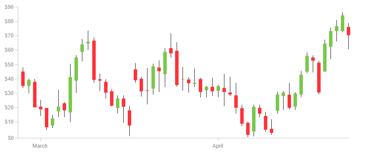

# Evaluación

## Instrucciones

- El trabajo es de caracter grupal (3 a 4 personas).

## Problema 1: Problema de analisis de sentimientos (50%).

Para las bandas de rock de habla inglesa más populares de los 90's se debe determinar si sus canciones poseen palabras con sentimientos positivos o negativos en base al estudio AFINN (https://www2.imm.dtu.dk/pubdb/pubs/6010-full.html).

### Instrucciones

- Se deberá implementar la solución del problema propuesto utilizando un motor de base de datos no relacional (se sugiere utilizar MongoDB que es el motor utilizado en clases y se adecúa de mejor manera al problema).
- Descargar la información Lyrics.json
- Cargar lyrics.json en una colección de MongoDB.
- Cargar lista de palabras AFFIN en una colección de MongoDB.
- Crear un script donde calcule y guarde los resultados en una colección llamada summary. El cual deberá tener la estructura: Nombre banda, canciones positivas y canciones negativas.
- Un canción positiva es si la suma de las palabras es mayor a O, en caso contrario, negativa.

## Problema 2: Trading bot (50%).

El trading es la especulación sobre instrumentos financieros con el objetivo de obtener un beneficio. El trading se basa principalmente en el análisis técnico, el análisis fundamental y la aplicación de una estrategia concreta para operar.

Los traders, realizan operaciones de compra y venta basada en la esperanza de que un instrumento suba o baje de precio. Generalmente estas decisiones son tomadas en base a indicadores técnicos de las series de precios de los intrumentos sobre los cuales desean operar.

    

La tecnología ha permitido (de poco), reemplazar esta operativa mediante el uso de "robots informáticos", que se encargan de automatizar las decisiones y realizar masivamente las operaciones de compra-venta bajo ciertas ventanas de tiempo (timeframes). Esto es posible debido a que son capaces de procesar mucha información en cuestión de segundos.

Su equipo ha sido contratado para definir la arquitectura de datos de una empresa que desea operar sus actividades de trading mediantes robots, pero desconocen qué tecnología de base de datos de adecúan a este contexto.

Los datos y casos de uso que se requieren para hacer trading son los siguientes.

### Datos

- Serie de precios (japanese candlestick chart) en ventanas de tiempo de 1m, 3m, 5m, 15m, 30m, 1h, 1d (https://en.wikipedia.org/wiki/Open-high-low-close_chart).

- Por cada serie de precios, se deben calcular alrededor de 50 indicadores de análisis técnico que permiten conocer el estado actual y potenciales movimientos en los precios. Esto se debe hacer cada vez que se actualize una serie de precio en los timeframes definidos.

- Libro de órdenes de compra y venta (order book) del mercado de cada instrumento cotizado cada 5 segundos. (https://en.wikipedia.org/wiki/Order_book)

- Estado actual de un instrumento (Tickers). Acá se obtiene el precio actual del instrumento, capital total invertido en él y otros atributos estáticos (insdustria, mercado donde cotiza, etc). Esto se debe hacer cada 5 segundos.

### Casos de uso

- Se deben configurar 3 robots para que operen su propio portafolio. (low risk, medium risk, high risk)

- Cada robot tendrá parámetros que se pueden actualizar cada día, los cuales le definen los instrumentos sobre cuáles operar y su estrategia de gestión de riesgo (take profit and stop loss). (https://es.wikipedia.org/wiki/Stop_loss)

- El robot deberá ser capaz de calcular antes y después de cada orden de compra y venta realizada la valorización de sus posiciones en el mercado.

- Se deberá generar un informe cada 1 hora de las operaciones de cada robot donde se indiquen los rendimientos individuales y globales de sus posiciones.

### Instrucciones

Generar un diagrama de la solución global de cada dato y caso de uso requerido, e indicar qué motores de base de datos se adecúan de mejor forma a cada problemática, la selección debe argumentada técnicamente considerando factores y características propias de las bases de datos vistas en clase (relacionales y no-relacionales).

## Plazo y formato de entrega

El plazo de entrega es el día domingo 10 de Octubre antes de las 23:59 hrs. Por cada minuto de atraso se descontará 1 décima en la nota final.

El formato de entrega es:

- Asunto correo: Trabajo Base de Datos - Grupo NºXX al mail me@ccosming.com
- Entregable (Adjunto de correo - 3 archivos):
  - Trabajo Base Datos - Problema 1 GrupoXX.pdf donde se entregue en una tabla el contenido de la colección summary.
  - Script llamado Sentimientos.js con la lógica de cálculo que genera la colección summary solicidada.
  - Trabajo Base Datos - Problema 2 GrupoXX.pdf donde se entregue lo solicitado en el problema (máximo 2 hojas).
