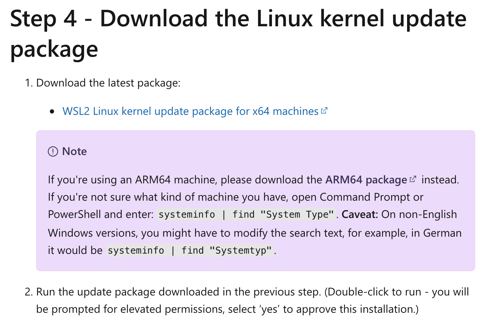
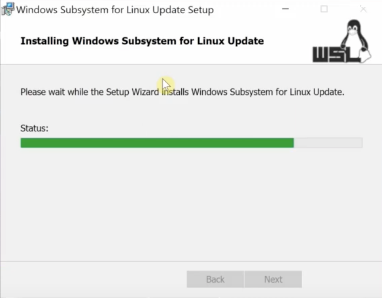
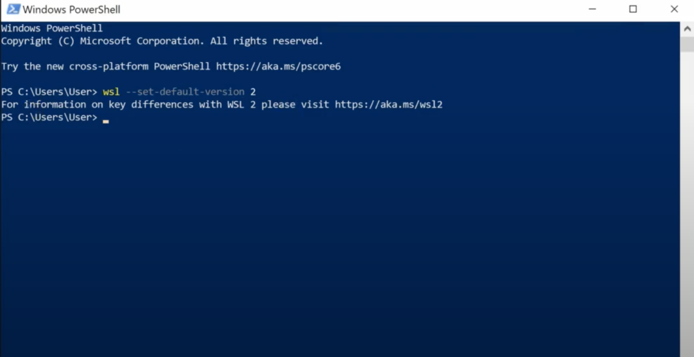
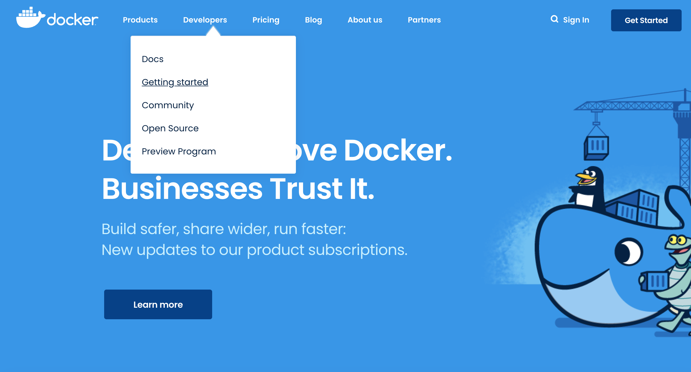
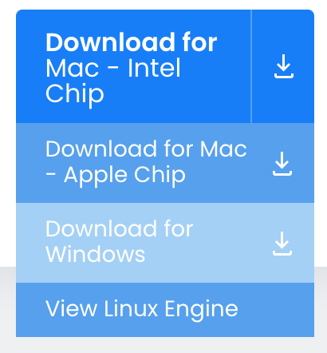
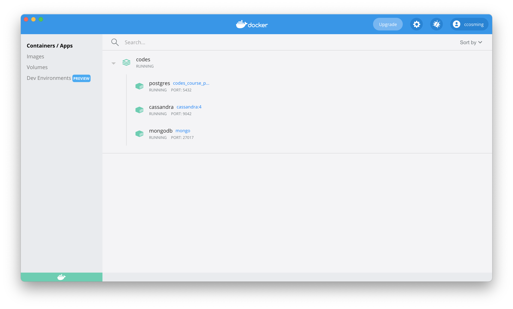

# Instalar y configurar Docker

## Paso 1: Instalación WSL

- Ir a la página https://docs.microsoft.com/en-us/windows/wsl/install-manual, bajar link del paso 4 para descargar WSL (Windows Subsystem Linux) e instalar




- Abrir Power Shell de Windows e introducir el siguiente comando.

```bash
wsl --set-default-version 2
```



- Ir al Microsoft Store e instalar Ubuntu. Luego de instalar se deberá ingresar por consola un username y password.


## Paso 2: Instalación Docker Desktop.

- Ir a la página de http://docker.com y descargar Docker Desktop e Instalar. Con esto Docker estará disponible para levantar contenedores.





## Paso 3: Instalación de MongoDB, Cassandra y Postgres.

Clonar el repositorio del curso y realizar la siguiente secuencia de comandos en la carpeta raíz de la clonación.

```bash
cd codes
docker-compose up --build --detach
```

Con el paso anterior tendrán lo siguiente:



## Paso 4: Entrar al contenedor e interactuar con el Motor MongoDB.

```bash
# Listar los contenedores activos
docker container ls

# Copiar el ID del contenedor y ejecutar el siguiente comando. Donde XXXXXXXXXXXX es el ID del contenedor.
docker exec -it XXXXXXXXXXXX

# Dentro del contenedor ejectuar el comando mongo para entrar a la consola de Mongo db.
root@XXXXXXXXXXXX: mongo

# Luego pueden ejecutar comando tales como.
show dbs    # Muestra las bases de datos disponibles
use music   # Entrar a la base de datos music y trabajar ahí (se creará cuando se registre alguna colección).
```

## Nota

Recordar que para poder subir archivos a mongodb utilizando el comando _mongoimport_ es necesario compartir un volumen con el Host, es decir, con el sistema operativo principal. Es por eso que se generó un volumen en el archivo docker-compose.yaml que apunta a la carpeta _codes/files_. Ahí encontrarán los archivos de ejemplo del curso y del trabajo y quedó montado en _/files_ del contenedor de docker.
