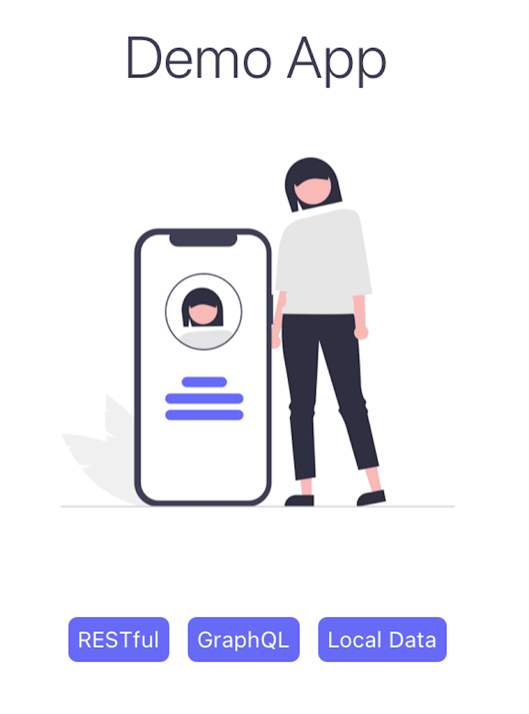

# :iphone: React Native Demo App :iphone:



Esta aplicación busca entregar conceptos relacionados a los siguientes puntos.

- Entender el ciclo de vida de los componentes dentro de la aplicación utilizando [React Hooks](https://es.reactjs.org/docs/hooks-intro.html).
- Navegación dentro de la App utilizando _React Navigation_.
- Consumir API REST.
- Consumir API GraphQL.
- Persistencia de datos (storage local).

Esta aplicación esta construida en base al Framework [React Native](https://reactnative.dev/) y usando la herramienta [Expo](https://docs.expo.io/).

## :open_file_folder: Estructura de la aplicación

La aplicación posee 4 pantallas (_Stack.Screen_) las cuales son las siguientes:

1. **HomeVew:** Home de la App, con tres links a las otras pantallas mediante [React Navigation](https://reactnavigation.org/docs/getting-started).
2. **RestView**: Consume una API RESTful utilizando la función [fetch](https://reactnative.dev/docs/network).
3. **GraphqlView**: Consume una API GraphQL utilizando [Apollo Client](https://www.apollographql.com/docs/react/integrations/react-native/).
4. **LocalDataView**: Guardar y rescatar datos desde el storage del dispositivo utilizando [AsyncStorage](https://react-native-async-storage.github.io/async-storage/docs/usage/).

```typescript
<NavigationContainer theme={DefaultTheme}>
  <Stack.Navigator initialRouteName="Home">
    <Stack.Screen name="Home" component={HomeView} />
    <Stack.Screen name="Rest" component={RestView} />
    <Stack.Screen name="Graphql" component={GraphqlView} />
    <Stack.Screen name="LocalData" component={LocalDataView} />
  </Stack.Navigator>
</NavigationContainer>
```

### Pantalla Home

**Objetivo**

Desplegar en el Home tres botones que acceden a las otras 3 pantallas de la aplicación.

**Highlights**

Se genera un componente reutilizable llamado LinkButton cuyo objetivo es generar un botón con que recibe tres parámetros:

- _text_: para el texto del botón.
- _link_: nombre del screen al cual debe dirigirse.
- _navigation_: objeto de la librería **React Navigation** que realiza la acción de redirigir al screen objetivo

```typescript
const LinkButton = ({ text, link, navigation }: any) => (
  <Pressable
    style={styles.buttonContainer}
    onPress={() => navigation.navigate(link)}
  >
    <Text style={styles.buttonText}>{text}</Text>
  </Pressable>
);
```

Ejemplo de uso en la aplicación:

```typescript
<LinkButton text="RESTful" link="Rest" navigation={navigation} />
<LinkButton text="GraphQL" link="Graphql" navigation={navigation} />
<LinkButton
  text="Local Data"
  link="LocalData"
  navigation={navigation}
/>
```

La imagen de la aplicación de renderizada utilizando el objeto de React Native llamdo _Image_.

```typescript
<Image source={require("./images/home.png")} style={styles.image} />
```

### Pantalla RestView

**Objetivo**

Consumir un API RESTFUL cuando el usuario presiona el botón _Get Pokemons_.

**Highlights**

Se utiliza la función _fetch_ para obtener los datos de la API de ejemplo (pokemons). Adicionalmente, se utiliza una variable reactiva llamada _pokemonList_ usando el hook _useState_ de React.

```typescript
const [pokemonList, setPokemon] = useState<string[]>();

const getPokemons = async () => {
  const pokemonCall = await fetch("https://pokeapi.co/api/v2/pokemon/");
  const pokemonData = await pokemonCall.json();
  setPokemon(pokemonData.results.map((p: any) => p.name));
};
```

La variable reactiva es "seteada" por la función _getPokemon_ en la acción _setPokemon_. Esta acción es invocada en el evento _onPress_ del botón de la pantalla.

```typescript
<Button title="Get Pokemons" onPress={() => getPokemons()} />
```

### Pantalla GraphQL

**Objetivo**

Consumir un API GraphQL cuando al momento en que usuario ingresa a la pantalla.

**Highlights**

Para poder consumir la API se requiere crear un _cliente_ que realice queries y reciba la data. Para ello se utiliza la librería Apollo.

```typescript
const graphqlClient = new ApolloClient({
  uri: "https://graphql-weather-api.herokuapp.com/",
  cache: new InMemoryCache(),
});
```

Este cliente debe inyectarse en el nivel superior de la aplicación vía un _React Provider_ que proporciona Apollo.

```typescript
 <ApolloProvider client={graphqlClient}>
```

A nivel funcional, lo que se requiere es ejecutar la query GraphQl, para ello se es necesario crear una variable con la estructura de la consulta a la API. Lo anterior se implementa mediante el tag _gql_ de Apollo.

```typescript
const GET_CITY = gql`
  query getCityByName($name: String!) {
    getCityByName(name: $name) {
      name
      country
      coord {
        lat
        lon
      }
    }
  }
`;
```

Dentro del componente principal se utiliza el hook provisto por Apollo llamado _useQuery_. Este retorna varios objetos, sin embargo, los más utilizados son:

- _data:_ Los resultados de la query realizada a la API.
- _loading_: Mientras se realiza la petición y se esperan los resultados esta variable es de valor true y data valor null.
- _error:_ Si ocurre algún problema en la petición, esta variable entrega el detalle del error.

```typescript
const { data, loading, error } = useQuery(GET_CITY, {
  variables: { name: "La Paz" },
});

if (loading) <Text>Loading...</Text>;
if (error) <Text>{error.message}</Text>;
```

### Pantalla Local Data

**Objetivo**

Guardar un valor persistente en el storage del disposivo cuando el usuario selecciona una de las dos opciones que se proponen en la pantalla.

**Highlights**

La funcionalidad se implementa utilizando _AsyncStorage_.

AsyncStorage funciona como un diccionario o hash, es decir, mapping llave-valor (key-value), por lo tanto, se accede, se asigna o elimina un valor mediante la key.

Puntualmente para esta implementación se utilizan las siguientes funciones:

- _setItem:_ para asignar el valor.
- _getItem:_ para obtener el valor.
- _removeItem:_ para eliminar el item.

Adicionalmente se declara una variable reactiva llamada _val_ para desplegar ese valor en pantalla.

```typescript
const [currentValue, setCurrentValue] = useState<string | null>();

const getPreference = async () => {
  const val = await AsyncStorage.getItem(STORAGE_KEY);
  setCurrentValue(val);
};

const setPreference = async (val: string) => {
  await AsyncStorage.setItem(STORAGE_KEY, val);
  getPreference();
};

const removePreference = async () => {
  AsyncStorage.removeItem(STORAGE_KEY);
  getPreference();
};
```

## :thinking: FAQ

### ¿Cómo instalar Node.js?

#### Windows

Lo más simple es descargarlo desde la página oficial de Node. Asegurar de bajar la versión LTS. [Link de descarga](https://nodejs.org/es/).

#### MacOS

**Forma newbie**

Idem a Windows (ver arriba).

**Forma intermediate**

```bash
brew install node
```

**Forma ninja**

Muchas veces se requiere tener distintas versiones de Node.js en el sistema para evaluar compatibilidades, revisar nuevos features, etc.

```bash
# Instalando nvm.
brew install nvm

# Instalando la versión LTS.
nvm install --lts

# Instalando una versión.
nvm install 12.14.1

# Instalando otra versión.
nvm install 14.16.0

# Dejando por defecto la versión más reciente.
nvm use node
```

### ¿Cómo instalar Yarn?

Ingresar a la consola de comandos y ejecutar (Unix Shell o PowerShell).

```bash
npm install --global yarn
```

### ¿Cómo instalar Expo?

Ingresar a la consola de comandos y ejecutar (Unix Shell o PowerShell).

```bash
# Instalando la herramienta Expo.
yarn global add expo-cli

# Creando la app utilizando Expo.
expo init DemoApp
```

### ¿Cómo se ejecuta la App?

Dentro de la carpeta raíz del proyecto (donde se encuentra el archivo _package.json_), ingresar a la consola de comandos y ejecutar (Unix Shell o PowerShell).

```bash

# Instalar dependencias del proyecto.
yarn install

# Para simular en iOS.
yarn ios

# Pra simular en Android.
yarn android

# Para simular para web.
yarn web
```

### ¿No me ejecuta el simulador de Android?

Instalar [Android Studio](https://developer.android.com/studio) y seguir la siguiente guía: https://docs.expo.io/workflow/android-studio-emulator/

### ¿No me ejecuta el simulador de iOS?

Si estás en Windows, no es posible. Sólo podrás vía conexión física de un dispositivo testear para iOS.

Si tienes un Mac, seguir la siguiente guía oficial: https://docs.expo.io/workflow/ios-simulator/, pero básicamente es tener instalado XCode y watchman.

### ¿Tengo otro problema?

Ingresar a la consola de comandos, ejecutar (Unix Shell o PowerShell) y compartir los errores o warnings.

```bash
expo doctor
expo diagnostics
```
