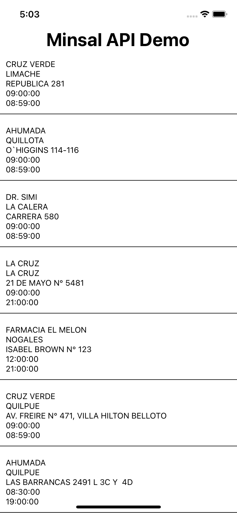

# :iphone: App API MINSAL :iphone:

App que consume datos desde la API del MINSAL (Minesterio de Salud de Chile).

<p align="center">
  
</p>

## ¿Cómo ejecutar la app?

```bash
# Instalar dependencias del proyecto.
yarn install

# Para simular en iOS.
yarn ios

# Pra simular en Android.
yarn android

# Para simular para web.
yarn web
```

## Dependencias del proyecto

No posee
