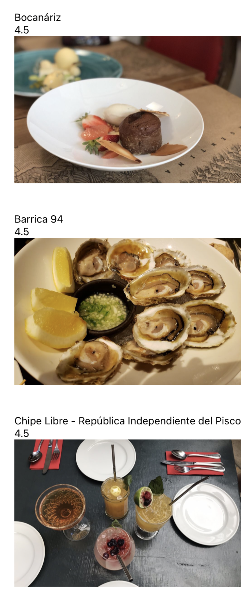

# :iphone: Yelp App GraphQL :iphone:

App que consume datos desde la API GraphQL de Yelp.

<p align="center">
  
</p>

## ¿Cómo ejecutar la app?

```bash
# Instalar dependencias del proyecto.
yarn install

# Para simular en iOS.
yarn ios

# Pra simular en Android.
yarn android

# Para simular para web.
yarn web
```

## Dependencias del proyecto

```bash
# GraphQL Apollo client
yarn add @apollo/client graphql
```
