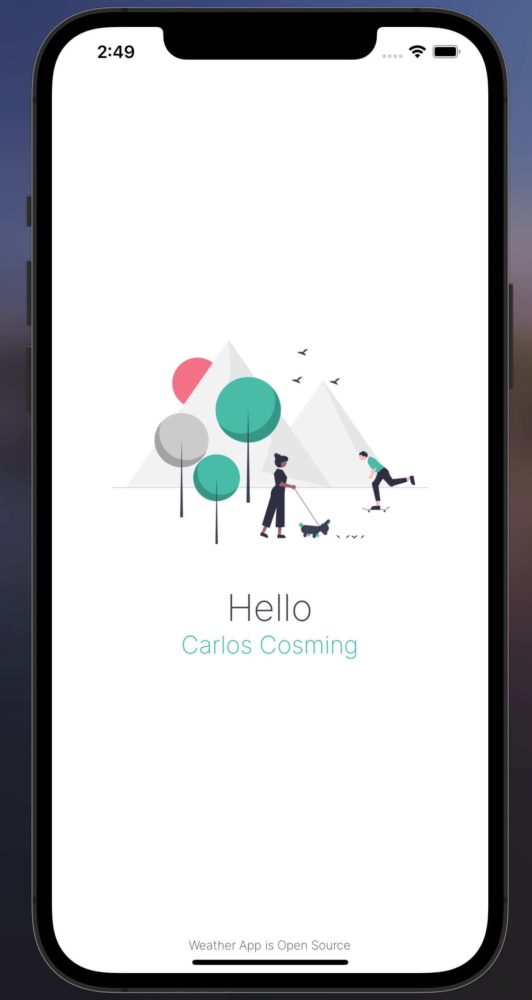
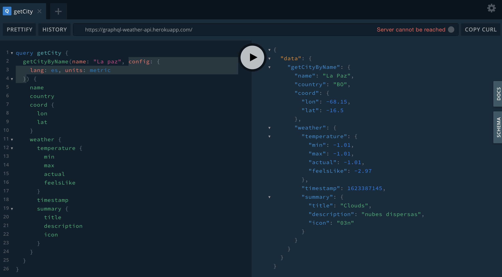
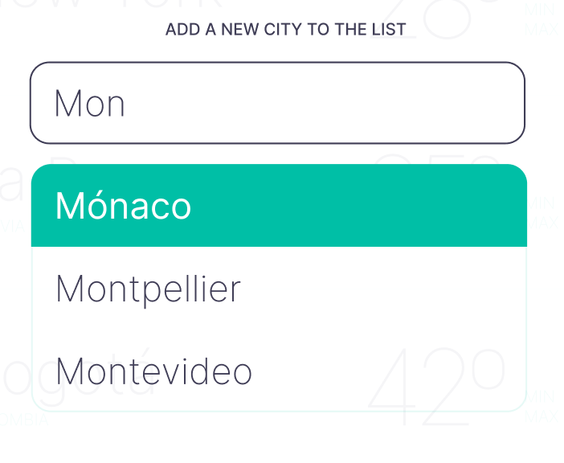
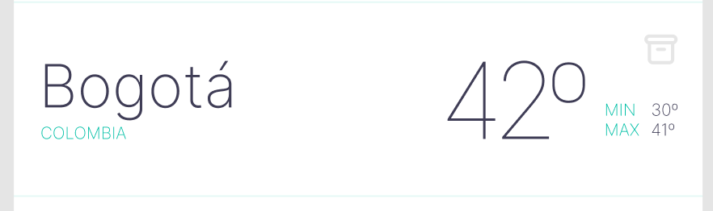

# Decripción general

En grupos de 2 o 3 personas, diseñar y desarrollar una aplicación multiplataforma utilizando Figma (Diseño) y React Native o Flutter (Desarrollo).

# Instrucciones

Cada grupo deberá proponer, describir, diseñar y desarrollar una aplicación móvil que cumpla con las siguientes características:

- La aplicación debe consumir data externos conectándose a una API pública.
- Debe guardar ser capaz de tener persistencia, es decir, guardar estados y configuraciones de la aplicación dentro del dispositivo.
- Debe poseer al menos 3 pantallas con interacción y despliegue de datos.
- Debe tener al menos 1 componente de entrada de datos.

**Ejemplo referencial.**

Weather App es una aplicación simple que muestra el clima actual de las ciudades que el usuario desee.

<!-- {style="height: 50px; margin: auto;"} -->

Posee 3 pantallas y que se conecta a una API pública basada en GraphQL ubicada en la siguiente URL: [https://graphql-weather-api.herokuapp.com/](https://https://graphql-weather-api.herokuapp.com/).

La aplicación permite guardar las ciudades favoritas del usuario para que dichas ciudades sean desplegadas en la pantalla principal. Esto permitirá que cada vez que el usuario abra la aplicacón, se despliegue la temperatura actual, mínima y máxima de cada ciudad configurada.

La manera de agregar o quitar una ciudad se realiza mediante una pantalla de configuración donde se despliega una _Lista autocomletable_ que sugiere el nombre de la ciudad en base al texto ingresado.

La eliminación de una ciudad, se realiza en la pantalla principal presionando el ícono _Eliminar_.

Todas las operaciones de agregación o eliminación, son confirmadas mediante un cuadro de díalogo.

# Entregas y plazos

Enviar al correo me@ccosming.com lo siguiente:

### Entregable 1: Proyecto y diseño (antes de las 23:59 del día 20 de Junio)

- Archivo **.pdf** de 1 o 2 hojas con la explicación de la aplicación e imágenes del mockup (similar al ejemplo entregado). Los nombre de los archivos son:
  - Documento: GrupoXX_NombreApellido1_NombreApellido2_Descripción.pdf
  - Mockup Figma: GrupoXX_NombreApellido1_NombreApellido2_Figma.fig

### Entregable 2: Desarrollo (antes de las 23:59 del día 04 de Julio)

- Enviar link repositorio **Github** o plataforma online como **Expo** con el código del proyecto final. Además se debe adjuntar respaldo del código y un video de 1 a 2 minutos mostrando y explicando su funcionamiento. Los nombres de los archivos son:
  - Código: GrupoXX_NombreApellido1_NombreApellido2_Código.zip
  - Video: GrupoXX_NombreApellido1_NombreApellido2_Video.mp4
